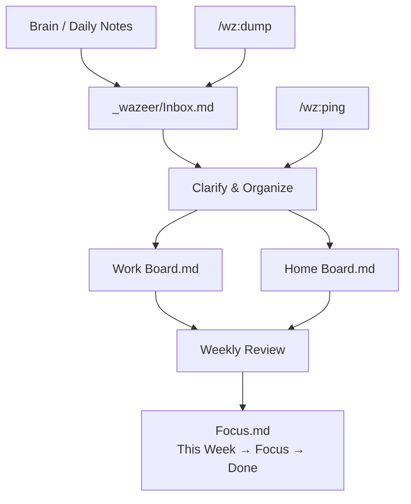

# Wazeer

A personal GTD system powered by Claude Code. Wazeer turns Claude into your trusted advisor — a mentor, coach, and operations strategist who maintains your boards, tracks your work, captures brain dumps, and keeps you accountable.

Install the plugin, create a directory, and say "let's setup wazeer using the wazeer-setup skill". Wazeer takes it from there.

## What It Does

- **GTD boards** - Three Kanban boards (Focus, Work, Home) with proper separation between planning and execution
- **Smart reconciliation** - `/wz:ping` reads your vault, shows what changed, proposes updates, waits for your OK
- **Zero-friction capture** - `/wz:dump buy milk` captures to inbox with AI-inferred metadata. Works from any project
- **Rich card tracking** - Structured cards for bugs, escalations, or anything needing ongoing tracking, with companion notes and next-action lines
- **Accountability** - Wazeer flags items that keep sliding, notes patterns (late nights, overload), and keeps the big picture so you can focus
- **Vault hygiene** - Wazeer enforces folder structure during pings, catches strays, keeps visual clutter down
- **Editor agnostic** - Works with Obsidian, Neovim, or any markdown editor. Learns your kanban plugin's format during setup

## Quick Start

Wazeer lives in a directory on your machine — your **vault**. This is where your boards, notes, and inbox live. Create it anywhere you like, start Claude Code, and install the plugin using Claude Code's `/plugin` skill. The setup skill then walks you through everything interactively.

```bash
mkdir ~/path/to/your/vault && cd ~/path/to/your/vault
claude
```

```
/plugin marketplace add devguyio/wazeer
/plugin install wz@wazeer
```

The install command presents a wizard — choose **"Install for you, in this repo only (local scope)"**. After you install and reload the plugin, use the setup skill by entering the following prompt:

```
let's setup wazeer using the wazeer-setup skill
```

Wazeer walks you through everything interactively: editor choice, kanban plugin, profile, board customization, and a first ping.

## Skills

| Skill | What it does |
|-------|-------------|
| `/wz:ping` | Wake-up call. Reconcile vault state, propose board updates, refresh Status.md |
| `/wz:ping fresh` | Full re-read, ignore git change detection |
| `/wz:dump <thought>` | Your single inbox, from anywhere. Capture to vault no matter which project you're in |

## How It Works



**Three boards, clear separation:**
- **Focus.md** - What you're doing this week. Pull to Focus, complete to Done.
- **Work Board.md** - Work project backlog. Clarified, not yet scheduled.
- **Home Board.md** - Personal project backlog. Same structure.

**Card types are yours to define.** Every card gets a short slug prefix (e.g. `TODO-01`, `REV-02`, `BUG-03`). Define categories that match how you think — the setup flow walks you through it.

## The Persona

Wazeer is opinionated about how it operates:

- **Competent, brief, dry wit** - JARVIS, not Clippy
- **No fluff, no sycophancy** - direct and pragmatic
- **Action-oriented** - every conversation produces next steps
- **Accountability-focused** - flags patterns, notes what keeps sliding
- **System refinement over creation** - optimize what exists, don't reinvent

The persona is fully configurable in your vault's `CLAUDE.md`. Make it yours.

## Global `/wz:dump`

During setup, Wazeer installs `/wz:dump` as a user-wide skill. This makes it available in every Claude Code session — not just inside the vault. Brain dumps happen everywhere; capture them without context switching.

## Documentation

- [Getting Started](docs/getting-started.md) - Full setup walkthrough
- [Concepts](docs/concepts.md) - GTD flow, board structure, card conventions
- [Customization](docs/customization.md) - Persona tweaks, faith-aware mode, custom tags

## Requirements

- [Claude Code](https://docs.anthropic.com/en/docs/claude-code/overview)
- A text editor (Obsidian recommended, Neovim and others supported)
- Git

## Development

### Local testing

From the repo root, load the plugin directly:

```bash
cd /path/to/wazeer
claude --plugin-dir ./plugins/wz
```

Or add the repo as a local marketplace:

```
/plugin marketplace add /path/to/wazeer
/plugin install wz@wazeer --scope project
```

### End-to-end test

```bash
mkdir /tmp/wazeer-test && cd /tmp/wazeer-test
claude --plugin-dir /path/to/wazeer/plugins/wz
```

```
let's setup wazeer using the wazeer-setup skill
```

### Validate plugin structure

```bash
cd /path/to/wazeer
claude plugin validate .
```

### Project structure

See [CLAUDE.md](CLAUDE.md) for the full development guide — repo layout, skill conventions, architecture decisions, and how to add new skills.

## License

Apache-2.0
