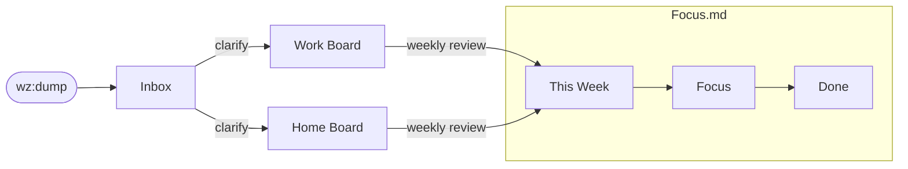

# Wazeer

**Wazeer** /wæˈziːr/ (Arabic: وزير) — *n.* minister or counselor. The one who bears the burden so the leader can lead.

Wazeer is a personal AI advisor that lives in your terminal. You give it a persona — a mentor, a coach, a strategist, whoever you need — and it stays with you throughout your day, helping you plan, stay focused, and follow through.

It's not a tool you open when you need something. It's a presence. You plan your week with it. It runs all day while you work. When a thought hits you mid-task, you dump it without switching context. When you drift, it nudges you back. When things keep sliding, it flags the pattern.

Wazeer is a [Claude Code](https://docs.anthropic.com/en/docs/claude-code/overview) plugin. It manages your tasks through markdown boards in a local directory — your **vault** — works with whatever text editor you prefer, and keeps everything on your machine.

## What a Day Looks Like

**Morning** — You open your vault and say `/wz:ping`. Wazeer reads your boards, shows what changed, flags anything overdue, and helps you decide what to focus on today.

**Throughout the day** — Wazeer is with you in the terminal. You talk to it — share task updates, tell it what's done or blocked, jot down meeting notes and daily notes. A thought strikes? `/wz:dump call dentist` — captured, tagged, no context switch. Need to decide what's next? Ask. Wazeer knows your boards, your week plan, your patterns.

**Weekly** — You sit down with Wazeer for a proper review. What got done, what slid, what matters next week. Cards move, priorities shift, and you walk away with a clear plan.

## The Persona

Wazeer takes on whatever persona fits your working style. During setup, you shape who your advisor is — tone, mentoring style, what it pushes you on, how direct it gets.

The default is a **veteran CTO**: direct, pragmatic, dry wit — JARVIS, not Clippy. But this is just a starting point. Define your own, or adjust it anytime in your vault's `CLAUDE.md`.

The persona isn't cosmetic. It shapes how Wazeer mentors you, what it flags, how hard it pushes, and what kind of guidance it offers.

## Quick Start

Wazeer lives in a directory on your machine — your **vault**. This is where your boards, notes, and inbox live. Create it anywhere you like, start Claude Code, and install the plugin.

```bash
mkdir ~/path/to/your/vault && cd ~/path/to/your/vault
claude
```

```
/plugin marketplace add devguyio/wazeer
/plugin install wz@wazeer
```

The install command presents a wizard — choose **"Install for you, in this repo only (local scope)"**. After you install and reload the plugin, start setup:

```
let's setup wazeer using the wazeer-setup skill
```

Wazeer walks you through everything interactively: editor choice, kanban plugin, persona, board customization, and a first ping.

## Skills

| Skill | What it does |
|-------|-------------|
| `/wz:ping` | Wake-up call. Reconcile vault state, propose board updates, refresh Status.md |
| `/wz:ping fresh` | Full re-read, ignore git change detection |
| `/wz:dump <thought>` | Capture to inbox from anywhere — works in any Claude Code session, not just the vault |

## How It Works



**Three boards, clear separation:**
- **Focus.md** — What you're doing this week. Pull to Focus, complete to Done.
- **Work Board.md** — Work project backlog. Clarified, not yet scheduled.
- **Home Board.md** — Personal project backlog. Same structure.

**Card types are yours to define.** Every card gets a short slug prefix (e.g. `TODO-01`, `REV-02`, `BUG-03`). Define categories that match how you think — the setup flow walks you through it.

**Editor agnostic.** Works with Obsidian, Neovim, or any markdown editor. Wazeer learns your kanban plugin's format during setup and adapts to it.

## Documentation

- [Getting Started](docs/getting-started.md) - Full setup walkthrough
- [Concepts](docs/concepts.md) - GTD flow, board structure, card conventions
- [Customization](docs/customization.md) - Persona tweaks, faith-aware mode, custom tags

## Requirements

- [Claude Code](https://docs.anthropic.com/en/docs/claude-code/overview)
- A text editor (Obsidian recommended, Neovim and others supported)
- Git

## Development

### Local testing

From the repo root, load the plugin directly:

```bash
cd /path/to/wazeer
claude --plugin-dir ./plugins/wz
```

Or add the repo as a local marketplace:

```
/plugin marketplace add /path/to/wazeer
/plugin install wz@wazeer --scope project
```

### End-to-end test

```bash
mkdir /tmp/wazeer-test && cd /tmp/wazeer-test
claude --plugin-dir /path/to/wazeer/plugins/wz
```

```
let's setup wazeer using the wazeer-setup skill
```

### Validate plugin structure

```bash
cd /path/to/wazeer
claude plugin validate .
```

### Project structure

See [CLAUDE.md](CLAUDE.md) for the full development guide — repo layout, skill conventions, architecture decisions, and how to add new skills.

## License

Apache-2.0
